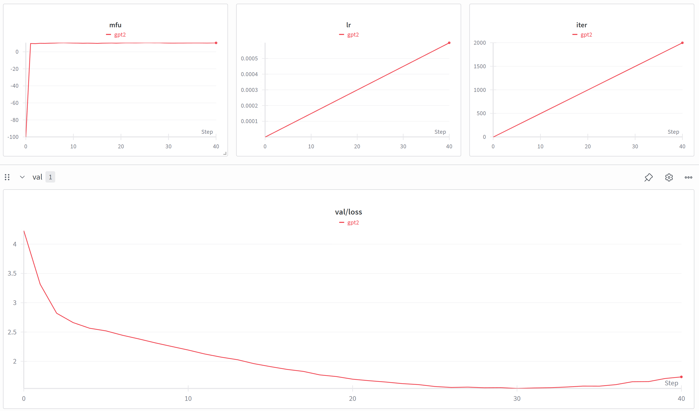

# 我的nanoGPT学习笔记

## 📝 nanoGPT 学习笔记

本项目是我的 nanoGPT 实战记录。
详细的学习心得、实验图表及源码注释请移步：
[👉 Study Notes 分支](../../tree/study-notes)

### 1. 测试环境 (Test Environment)

在正式开始模型训练前，明确硬件与软件的基准线至关重要。

* **硬件设备 (Hardware):**
* **GPU:** NVIDIA GeForce RTX 4070 Ti Super (16GB VRAM) —— *注：这是目前性价比极高的 40 系列显卡，其 16GB 大显存允许我们尝试更大的 `batch_size`。*
* **CPU:** Intel i7-12700K


* **软件环境 (Software):**
* **操作系统:** Windows 11
* **Python 版本:** 3.12
* **核心框架:** PyTorch 2.5.1+cu121 (或其他版本，可用 `pip show torch` 查看)


* **关键配置说明 (Configuration Notes):**
* **Device:** 使用 `cuda` 加速。
* **Compile:** 设为 `False`。*排雷心得：在 Windows 原生环境下，由于 Triton 编译器暂不支持，开启 `compile=True` 会导致报错，故采用 Eager 模式训练。*
* **数据集:** `shakespeare_char` (莎士比亚字符级数据集)，总计约 111 万个字符。

---

### 1.5 实验监控配置 (Experiment Tracking)

为了实现训练过程的可视化管理，我引入了 **Weights & Biases (W&B)** 工具。相比于枯燥的终端日志，它能提供更直观的监控维度。

* **账号与登录**:
* **平台账号**: `zqc199304`。
* **本地验证**: 通过执行 `wandb login` 命令，并输入从官网获取的 API Key 完成环境绑定。
* **存储位置**: 验证成功后，凭证将自动存储在 `C:\Users\ZHU Qingchuan\_netrc` 路径下，确保后续训练能自动同步数据。


* **监控优势**:
* **实时 Loss 曲线**: 能够实时观察 `train/loss` 和 `val/loss` 的走向，直观判断模型是否收敛或过拟合。
* **硬件效能记录**: 自动记录 RTX 4070 Ti Super 的 MFU (模型利用率)、功率以及温度波动。


### 2. 数据准备与编码原理 (Data Preparation)

在开始训练之前，必须运行 `data/shakespeare_char/prepare.py`。这个过程在 `nanoGPT` 中被称为 **Tokenization（分词/分号化）**。

* **数据源**：使用的是莎士比亚全集。脚本首先读取原始的 `.txt` 文本，并识别出文本中所有出现的唯一字符。
* **词表 (Vocabulary)**：对于这个特定的数据集，模型识别出了 **65 个唯一字符**（包括大小写字母、空格、换行符和标点）。
* 例如：`'\n'` 对应编号 0，`' '` 对应编号 1，`'!'` 对应编号 2，以此类推。


* **编码 (Encoding)**：脚本将整本名著从“字符流”转换为“整数流”。
* **Train Set**: 约 100 万个 token。
* **Val Set**: 约 11 万个 token。


* **存储格式**：生成的 `.bin` 文件是以 `uint16` 格式存储的二进制文件。这种格式能让 PyTorch 在训练时以极高的效率直接将数据加载到内存或显存中，避免了读取文本文件时的字符解码开销。

---

#### 核心发现：模型到底在学什么？

通过观察 `prepare.py` 的输出，我意识到：

1. **GPT 不识字**：模型看到的只是 `0, 18, 47, 64...` 这样的数字序列。
2. **预测任务**：训练的本质是给模型序列 `[1, 2, 3]`，让它预测下一个数是 `4` 的概率。
3. **压缩的艺术**：我们将 111 万个字符压缩成了 65 个基础单元的组合。

---

**💡 助教点评：**
“字符级（Character-level）模型是理解原理的最佳切入点。虽然像 GPT-4 这样的模型使用的是更复杂的 **BPE (Byte Pair Encoding)** 分词方式（把常用的词根分在一起），但其底层逻辑与你现在看到的这 65 个字符的映射是一模一样的。理解了这 65 个数字，你就理解了 LLM 的输入本质。”

在 nanoGPT 的 shakespeare_char 实验中，词表仅为 **65**。这意味着模型是在“像素级”地学习语言。它必须从头学习如何拼写单词，再学习如何组合句子。相比之下，主流大模型拥有**5 万甚至 10 万**以上的词表，它们是在“词汇级”进行思考。虽然词表规模不同，但其将文字转化为数字索引的底层逻辑是完全一致的。

**词表（Vocabulary）并非按类别计数，而是按“唯一性”计数**。每一个独特的字符——无论是大写字母、小写字母、数字，还是每一个具体的标点符号（如 . , ! 等）——都会在词表中占据一个独立且唯一的索引位置。在 shakespeare_char 数据集中，这 65 个位置涵盖了所有出现在文集中的符号总数。

---


### 3. 训练启动命令

* **完整集成启动指令**:
为了同时利用 GPU 加速并开启可视化监控，完整的执行命令如下：
```bash
python train.py --dataset=shakespeare_char --device=cuda --compile=False --wandb_log=True --eval_interval=50 --eval_iters=20 --log_interval=10 --block_size=256 --batch_size=64 --n_layer=4 --n_head=4 --n_embd=256 --max_iters=2000
```

* `--wandb_log=True`: 激活 W&B 云端同步。
* `--device=cuda`: 指定使用 RTX 4070 Ti Super 进行计算。
* `--compile=False`: 避开 Windows 环境下 Triton 编译器的兼容性问题。
* **`--eval_interval=50`**：这是关键！原本模型可能每 500 步才算一次验证集 Loss，现在改为每 50 步算一次，这样你在 WandB 上就能看到每 50 步一个的验证集数据点，连起来就是优美的曲线。
* **`--eval_iters=20`**：因为评估变频繁了，我们将每次评估时随机抽取的样本数减小到 20，这样不会拖慢整体训练速度。


> * **问题记录**：初次实验由于 `eval_interval` 默认为 500，导致 WandB 上的 `val/loss` 曲线信息缺失。
> * **解决策略**：将评估间隔调整为每 50 次迭代一次，并优化了同步参数。
> * **收获**：获得了连续的 Loss 下降曲线。观察发现，验证集损失在约 1200 步后开始趋于平缓，这为后续调整训练时长提供了量化依据。
> 

**💡 助教点评：**
“虽然 4070 Ti Super 性能强劲，但因为 `nanoGPT` 默认模型较小（3.16M 参数），此时显卡的 **MFU (模型利用率)** 仅在 11% 左右。这意味着显卡还没‘出汗’计算就结束了。如果未来增加 `n_layer` 到 12 层或增加 `n_embd` 到 768，显卡的潜力会得到更好的释放。”

---

### 4. 实验结果与可视化分析 (Results & Analysis)

#### **4.1 最终性能指标**

* **训练步数**: 2000 Iterations
* **Train Loss**: **0.9396** (模型对莎士比亚文本的拟合程度极高)
* **Val Loss**: **1.7345** (验证集表现稳定)
* **硬件效率**: 平均 **400ms/iter**，MFU 稳定在 **10.2%** 左右。由于 GPU 性能远超模型计算需求，显卡在训练期间温度极低，散热压力几乎为零。

#### **4.2 WandB 曲线解读**

通过对比两次实验并删除冗余数据，红线清晰地展示了以下训练特征：


* **收敛趋势**：Loss 在前 500 步呈现指数级下降，随后斜率放缓。
* **过拟合观察**：注意到 `val/loss` 在约 1500 步（Step 30）达到极小值后有轻微的反弹趋势。这说明 2000 步对于当前模型规模已经是学习的上限，再训练下去模型就会开始“死记硬背”训练集。
* **策略验证**：学习率（LR）的线性预热（Warmup）阶段在图表中清晰可见，它成功引导模型平稳度过了初期的不确定性。

---

### 5. 模型首秀：生成结果展示与评价 (Model Inference)

使用训练好的检查点 `ckpt.pt` 运行 `sample.py`，模型输出了具有浓厚莎士比亚风格的文本。
运行推理的代码指令如下：

```bash
python sample.py --out_dir=out --device=cuda
```

### 💡 推理代码参数详解

* **`python sample.py`**：调用项目中的采样脚本。
* **`--out_dir=out`**：这一步至关重要。它告诉脚本去 `out` 文件夹下寻找名为 `ckpt.pt` 的权重文件（这是你刚刚花费 15 分钟训练出来的“智慧结晶”）。
* **`--device=cuda`**：指定使用你的 RTX 4070 Ti Super 进行生成。虽然 CPU 也能跑推理，但 GPU 会让文字像泉水一样瞬间喷涌而出。

运行 `python sample.py --out_dir=out --device=cuda` 激活了模型。该脚本会自动加载训练生成的 `ckpt.pt` 文件，并基于 `data/shakespeare_char/meta.pkl` 里的 65 个字符词表，将模型预测的数字重新翻译回人类可读的字符。

#### **生成片段示例：**

```text
And they brings father on, being it;

The searing shame is call'd from a thousands,

Which he that are from whence have an one heaven;

Much injury, he live to cae and either post,

As those bastard before his services like down,

And she careless the harms of tyranny and knowdpant,

To stop the secrets of one and who Clifford,

Still us Aufidius me with half my seeding in

Be resent or some many merry in hold,

To fight against thy country's defence:

The cares of loving and prayers on reproof.


KING EDW

---------------


Menenius, and go them as they are bear; and therefore

they will adde; and be husband with one.


FRIAR LAURENCE:

Repen up. Wide our knee woes.
```

这段生成的文本是模型通过统计概率“拼凑”出来的。虽然它完美模仿了莎士比亚的语气和用词，但由于逻辑链条断裂，很多句子在语法上是破碎的，甚至含有生造词（如 `knowdpant`）。

以下是对这段采样结果的意译，我尝试在保持那种“舞台戏剧感”的同时，让破碎的逻辑显得自然一些：

**文本意译（莎士比亚风格）**

```bash

他们带着父亲走上前来，正因如此；
那灼人的羞辱被千万人传唤，
他，从那唯一的上天之处而来；
身负重伤，他活在坠落与邮驿之间，
正如那些杂种，在供职前便已倒下，
她对暴政的伤害与**惊恐**（生造词意译）漫不经心，
为了掩盖那唯一的秘密，还有那克利福德，
奥菲迪乌斯依然用我一半的精元与我同在，
或是心怀怨恨，或是欢欣地紧握，
去为抵御你的祖国而战：
慈爱之忧虑与责备之祈祷。

爱德华国王：

梅内尼厄斯，去跟着他们，就像他们原本的样子；
因此他们会变本加厉；并与一人结为连理。

劳伦斯神父：
悔悟吧。扩开我们膝下的悲哀。
---
```
**为什么翻译起来感觉“怪怪的”？**

你在阅读翻译时感到的不通顺，恰恰反映了模型在训练后的真实状态。我们可以从以下三个层面解析这些对话：

* **词法层面（单词正确）**：模型已经能拼写出 `thousands`, `tyranny`, `defence` 等高阶词汇，这说明它已经掌握了字母组合的概率。
* **句法层面（逻辑断裂）**：句子之间缺乏逻辑连接。例如 `And they brings father on, being it;` 在语法上是极其生硬的。这是因为模型的 `block_size`（注意力窗口）较小，且 316M 的参数量不足以让它理解深层的因果关系。
* **语境大乱斗**：这段话里同时出现了《亨利六世》的 Clifford、《科里奥兰纳斯》的 Aufidius 和 Menenius，以及《罗密欧与朱丽叶》的 Friar Laurence。模型并没有在“写剧本”，它只是在“莎士比亚风格”的概率海洋里随机垂钓。


> **采样结果翻译心得：**
> 翻译过程中发现，模型虽然掌握了“形”（如古英语代词、戏剧化名词），但尚未领悟“意”（长程逻辑）。采样文本表现出极强的**局部连贯性**和**全局荒谬性**。这说明模型目前只是一个极佳的“风格复印机”，而非真正的“剧作家”。

#### **深度解析：模型学会了什么？**

看到这些输出，你实际上正在见证一个**316万参数的“数字脑”如何从随机规律中重构文学风格**。这些对话之所以长成这样，是由 GPT 架构的本质和字符级（Character-level）训练的特点决定的。

**1. 格式上的“精准模仿”**

模型已经完美学会了莎士比亚剧本的**视觉排版规律**。

* **角色标识**：它知道每一个对话块（Chunk）通常以大写字母的角色名开头（如 `FRIAR LAURENCE:`, `ROMEO:`, `AUFIDIUS:`），且名字后面紧跟冒号。
* **台词结构**：它学会了台词的换行逻辑，使其看起来像诗剧（iambic pentameter）的节奏。
* **分隔符**：生成结果中出现的 `---------------` 是它在模仿数据集中不同剧本或章节之间的物理分隔符。

**2. 内容上的“语义幻觉” (Hallucination)**

你可能会发现这些对话“读起来很有感觉，但逻辑不通”，这是由于以下原因：

* **字符级预测的局限**：模型是一个字符一个字符“猜”出来的（比如猜到 `R`，后面概率最大的是 `O`, 然后是 `M`...）。它现在处于能拼对单词（如 `heaven`, `country`, `victory`），但无法理解整句长逻辑的阶段。
* **跨时空大乱斗**：你会看到《罗密欧与朱丽叶》里的 `ROMEO` 在和《科里奥兰纳斯》里的 `AUFIDIUS` 说话。这是因为在训练时，所有的剧本都被喂给了模型，模型把它们混成了一个巨大的“莎士比亚宇宙”。
* **单词创造**：模型偶尔会生造一些词，比如 `knowdpant` 或 `wrioDu'd`。这说明 0.94 的 Loss 虽然很低，但还没低到能完全规避拼写错误，它在尝试结合两个单词的概率时“手滑”了。

**3. 语言风格的“降维打击”**

即便逻辑混乱，模型却捕捉到了极其地道的**词频特征**：

* **代词习惯**：大量使用 `thou`, `thee`, `thy`。
* **动词变体**：使用了 `hath`, `seal'st`, `doth`。
* **戏剧化词汇**：高频出现 `shame`, `tyranny`, `heaven`, `death`, `blood`。
* **评价**：这说明模型成功捕捉到了莎士比亚文字中的“情绪底色”和“用词概率”。

> **对话生成逻辑分析：**
> 采样结果显示模型已从“随机字符”进化到了“风格模仿”阶段。
> * **局部连贯性**：在单词和短语层面（如 `The searing shame is call'd from a thousands`），模型表现出了惊人的预测准确度。
> * **全局逻辑缺失**：由于 `block_size` 仅为 256，且参数量较小，模型无法维持长程的剧情逻辑，导致角色混淆和语意碎片化。
> * **结论**：这证明了 GPT 的核心能力——**统计语言建模**。它并不理解什么是“死亡”或“爱情”，它只是计算出了在 `ROMEO:` 之后，出现 `Some stiles` 这类词汇的数学概率最高。
> 
> 
---
